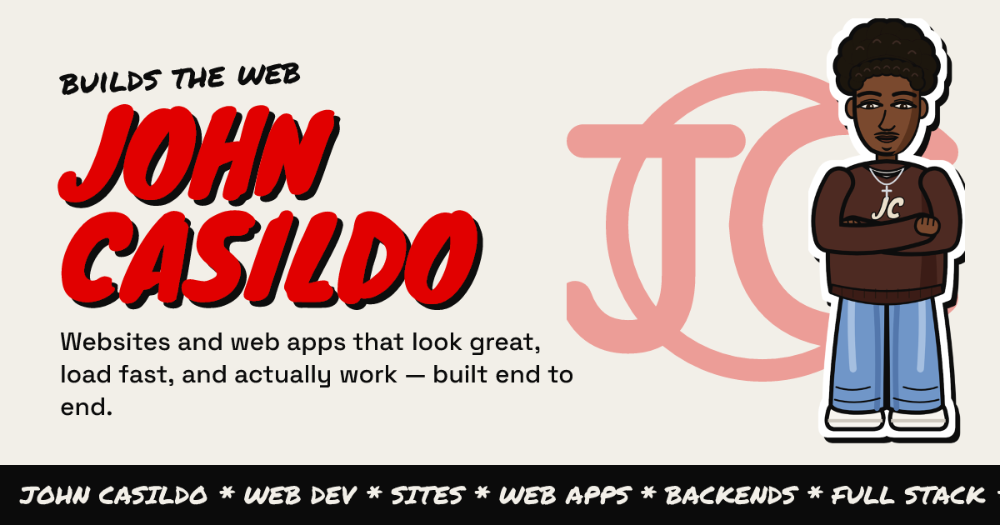

<h1 align="center">yo, I'm John 👋</h1>

  <b>Full-stack developer.</b> I build websites and web apps that look great, load fast, and actually work — from the database to the last pixel.

  
  

---

### ✱ what I'm about

- 🧱 I ship complete products end to end: frontend, backend, database, and deploy
- 📱 Native **iOS** (SwiftUI) and **Android** (Jetpack Compose) apps on one shared backend
- ⚡ Fast, memorable websites — my own portfolio scores 90+ on Lighthouse
- 🌎 I work in **English** and **Spanish**

### ✱ tools I use

  
  
  
  
  
  
  
  
  
  

### ✱ featured work

| | Project | What it is | Stack |
|---|---|---|---|
| ⭐ | **[Presencia](https://github.com/john-casildo/PresenciaApp)** | Attendance & activity tracking for small-group leaders — native iOS + Android on one Supabase backend | SwiftUI · Jetpack Compose · Supabase |
| 🎓 | **[Maruchan University](https://github.com/john-casildo/Maruchan_University)** | University management system: REST API, dashboard, one-command Docker setup | FastAPI · PostgreSQL · Streamlit · Docker |
| 🧾 | **[Stub](https://github.com/john-casildo/Stub)** | Screenshot-first budgeting app — no bank login, ever *(in progress)* | Flutter · On-device OCR |
| 🖌️ | **[Portfolio](https://github.com/john-casildo/portfolio)** | This zine-style site: comic sticker avatar, graffiti, EN/ES | Next.js · TypeScript · Tailwind |

### ✱ stats

  
  

---

  <i>got a project? <a href="https://portfolio-lake-beta-12.vercel.app/en#contact">let's talk</a> ✱ <a href="https://portfolio-lake-beta-12.vercel.app/es#contact">hablemos</a></i>

